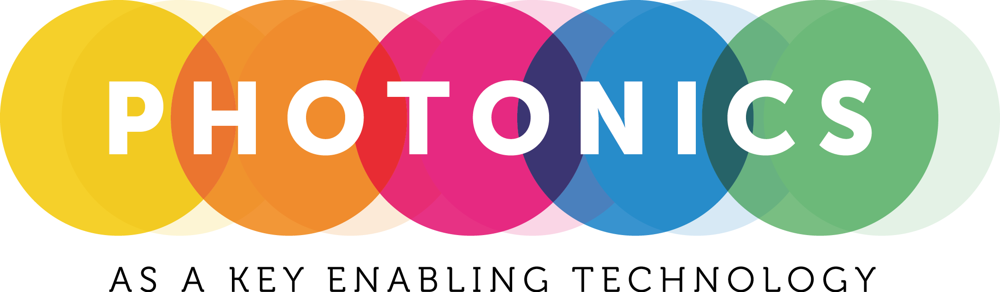

+++
title = "Photonics as a Key Enabling Technology"
date = "2025-12-12T15:00:00Z"
pubdate = "2025-11-02T12:00:00Z"
draft = false

[cover]
image = "https://lh3.googleusercontent.com/d/1pwKZA9gbH8T42G5QYTKT6PRBIDet9FNb=s1920"
alt = "Photonics as a Key Enabling Technology: Light up your Future"
relative = true

[[Share]]
name = "instagram"
url = "https://www.instagram.com/p/DRebP3ejpFr"
+++

# Light up your Future

UniTrento Alumni share their career path: have a chat, get inspired, and discover new opportunities after your studies!

📅 Date: 12th December  
🕠 Time: 15:00 - 17:00 + Aperitif  
📍 Location: Room A109, Polo Ferrari 1, via Sommarive 9, Povo (TN)  
☕ Registration for Food: [https://forms.gle/PvaH7zoQQSF37poVA](https://forms.gle/PvaH7zoQQSF37poVA)

## Program

### 15:00 Opening remarks

### 15:10 Tatevik Chalyan, Vrije Universiteit Brussel, Belgium
Sensing: From bio to quantum and beyond

### 15:30 Claudio Castellan, Glass to Power, Rovereto
Through an aesthetic transition: integrating photovoltaics in buildings

### 15:50 Chiara Vecchi, GEM elettronica, San Benedetto del Tronto
Integrated photonics: miniaturizing technology to maximize the applications

### 16:10 Coffee break

### 16:20 Alessandro Trenti, Austrian Institute of Technology, Vienna, Austria
Cracking the code: quantum cryptography from basics to breakthrough

### 16:40 Clara Zaccaria, University of Trento
Neural interfaces: from networks to single cells

### 17:00 Aperitif
